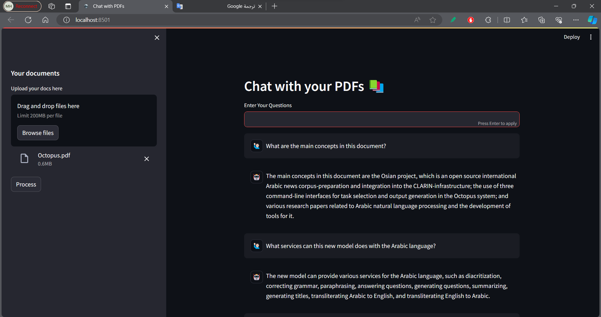

# Overview
This project is done in this [tutorial](https://youtu.be/dXxQ0LR-3Hg?si=g1EAwawqbThDZzZG). I strongly recommend it for anyone, it helped me to grap many things and I've added somethings in addition to all code from this video.

It simply takes your PDFs, and embeddings them then reponse to your prompt using the content in the pdf as a context.

> Note: the quality of your response depends on the quality of the model you'll use. So make sure to choose it carefully!


# Getting Started
1. Clone the Repository:
    ``` bash
    git clone https://github.com/mohamedhassan218/LangChain-Practice
    cd LangChain-Practice/chat-pdfs
    ```


2. Create a Virtual Environment:
    ```bash
    python -m venv .venv
    ```

3. Activate the Virtual Environment:
    - On Windows:
        ```bash
        .venv\Scripts\activate
        ```

    - On Unix or MacOS:
        ```bash
        source .venv/bin/activate
        ```


4. Install Dependencies:
    ``` bash
    pip install -r requirements.txt
    ```


5. Set up Environment Variables:
    Create a `.env` file in the project root and add the following variables:
    ```
    REPO_ID=repo_id
    ```


6. Run the Project:
    ``` bash
    streamlit run app.py
    ```


# Demo

The pdf on this demo is a research paper, you can find it [here](https://arxiv.org/pdf/2310.16127v1.pdf).




Feel free to take the code, customize it and try different ideas.